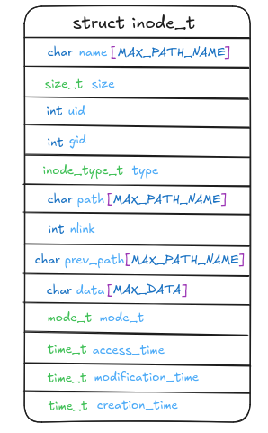
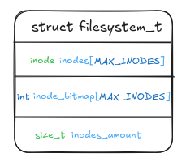
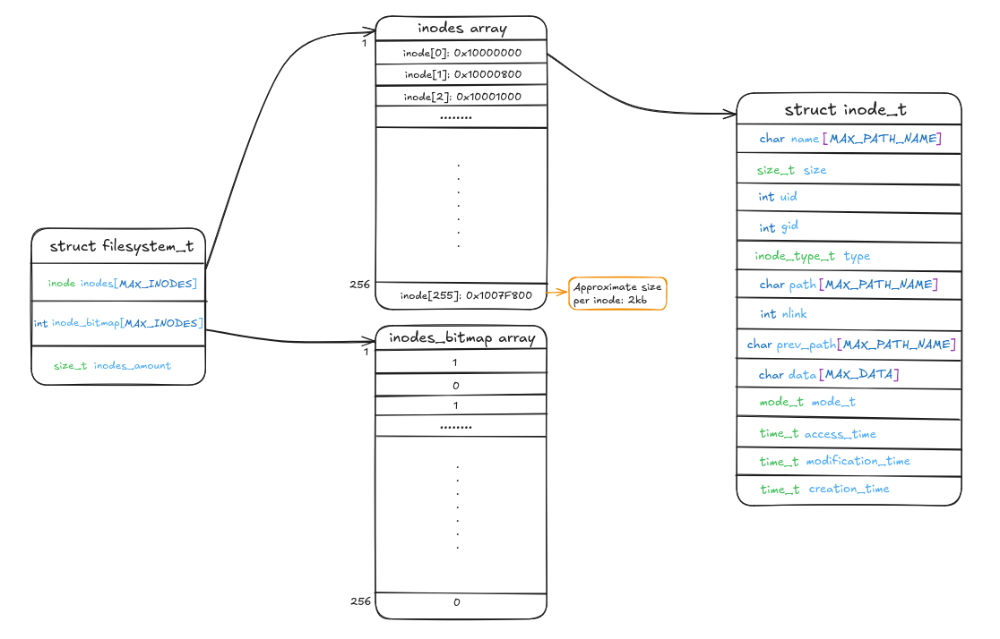

# fisop-fs

## Informe del File System implementado

### Estructuras en memoria:

Para nuestra implementación, se decidió que cada archivo o directorio estará representado por un inodo. Esta estructura almacena toda la metadata asociada, como así también el contenido en el caso de los archivos.



Una vez definida la forma de representar un único archivo/directorio, necesitamos una forma de almacenar múltiples inodos. Para esto se diseñó una estructura global denominada `filesystem_t` que vive completamente en memoria mientras el File System está activo. Su función principal es contener todos los inodos y su bitmap de ocupación. Además, cuenta con mecanismos de serialización y deserialización que permiten guardar y recuperar el estado del File System desde un archivo físico con extensión `.fisopfs`



Una representación conceptual podría verse de la siguiente manera:




### Busqueda de archivo dado su path:

Cada vez que se realiza una operación sobre un archivo (como `cat`, `more`, `less`, etc...) estas herramientas requieren que el File System sea capaz de ubicar el archivo a partir de su path absoluto. Para esto, el File System implementa la función `fs_lookup`, que realiza una busqueda del índice del inodo correspondiente al archivo solicitado y retornandolo siguiendo estos pasos:

1)  **Verifica que el path no sea la raiz:**

    Si el path recibido es simplemente `/`, la función retorna `0`, correspondiente al índice del inodo raíz.

2) **Extracción del nombre y del path previo:**

    Se utilizan las funciones auxiliares `extract_filename` y `extract_prev_path` para descomponer el path en dos partes:
    - `name`: el nombre del archivo o directorio buscado
    - `prev_path`: para saber donde esta contenido el archivo.

    Un ejemplo para el path `/prueba/pr1/arch.txt`:
    - `name` = `arch.txt`
    - `prev_path`: `/prueba/pr1`

3) **Busqueda del indice en la tabla de inodos**    

    Con los datos obtenidos ahora se recorre la tabla de inodos verificando que:
    - Que el inodo este en uso (`inode_bitmap[i] == 1`).
    - Que el nombre del inodo coincida con `name`.
    - Que el `prev_path` del inodo coincida con el path padre extraido.
    
4) **Resultado**

    - Si se encuentra coindicencia se retorna el indice `i` correspondiente.
    - Si en algún paso no se encuentra coincidencia, se retorna `-ENOENT` para indicar error (No such file or directory).

### Formato de serialización:
Para lograr la persistencia del estado del File System entre ejecuciones, se implementó un mecanismo de serialización binaria que guarda el contenido completo de la estructura principal `filesystem_t` en un archivo en disco. Esta funcionalidad se realiza mediante en la función `fs_serialize`.

**¿Que es lo que serializa?**

La estructura `filesystem_t` que contiene toda la información necesaria para reconstruir el estado del sistema de archivos, incluyendo:

- Tabla de inodos (`inode_table[MAX_INODES]`).
- Bitmap de inodos (`inode_bitmap[MAX_INODES]`)
- Cantidad de inodos (`inodes_amount`)

Al utilizar `fwrite(&fs, sizeof(fs), 1, f)`, se escribe el contenido del File System tal como está en memoria directamente al archivo en un formato binario.

El archivo generado con extensión `.fisopfs` en el cual se guarda todo el File System puede luego ser leído y cargado mediante la función complementaria `fs_deserialize`, restaurando así el File System tal como estaba antes de ser cerrado.


### TESTS ### 
A la hora de crear los tests decidimos utilizar un tester propio, el archivo `tester.h` tiene una pequeña implementacion de un tester general para representar la validación de una condición y mostrar el resultado como `ERROR` o `PASS` segun se cumpla o no la misma.

Los tests están pensados para utilizarse con el montaje del filesystem implementado por nosotros, por ende, es necesario realizarlo. Al realizarlo se fuerza que el filesystem utilizado sea el nuestro y no el definido por defecto en Linux. El punto de montaje, visible en el archivo `tests.c`, será el lugar donde se realizarán los tests del filesystem.

El objetivo de nuestros tests es probar nuestra implementación de filesystem con las diferentes funcionalidades que hemos implementado, sirven para buscar errores y/o respuestas ilógicas a la hora de crear, accceder y modificar archivos o directorios.

## ¿Cómo correr los tests? ##

Para correr los tests es necesario realizar los siguientes pasos: 

En la terminal ejecuta el siguiente comando: 

```bash
sudo make docker-run
```
luego:
```bash
./fisopfs -f <punto de montaje>/ --filedisk persistence_file.fisopfs
```
El punto de montaje en este caso es:
```bash
./fisopfs -f prueba/ --filedisk persistence_file.fisopfs
```
- Asegurarse que el punto de montaje este creado, en caso que no sea así, utilizar `mkdir prueba`.

Posteriormente, en otra terminal correr: 
```bash
sudo make docker-exec
```
y finalmente:
```bash
make test
```

Notar que cuando se realizan los tests, ya sea con el persistence_file.fisopfs o con cualquier otro, se quedan guardadas las pruebas en el punto de montaje para mostrar que realmente se utilizo este para los tests.

Finalmente se podrá observar por pantalla el resultado de los mismos.
